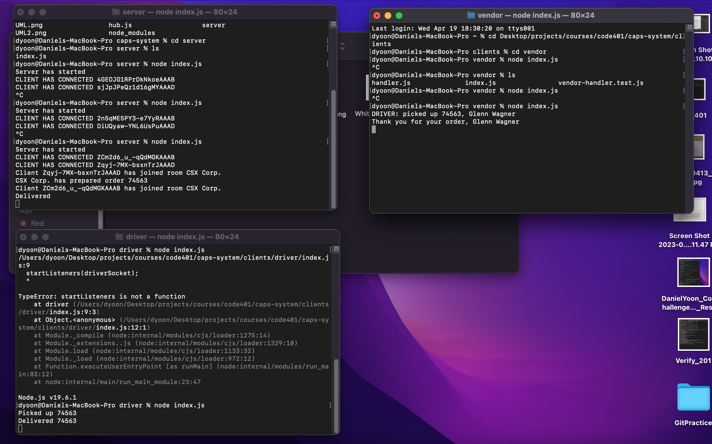

# caps-system

## Description
Code Academy Parcel Service - an application that will emulate a real world supply chain.

* Lab 11 - Event Driven Application
  * In this lab, we implement basic event listeners and emitters for a simulated order and delivery.
* Lab 12 - Socket.io
  * In this lab, we refactor our previous code with Socket.io.

Deploy Link: https://caps-3dm8.onrender.com

PR: https://github.com/yd24/caps-system/pull/1

PR2: https://github.com/yd24/caps-system/pull/4

Github Actions: https://github.com/yd24/caps-system/actions

## Notes
To test Socket.io implementation currently, we need to start up three terminals. In the first terminal, run node /server. In the second terminal, run node /clients/driver. In the third terminal, run node /clients/vendor. All terminals should show appropriate console logs for the events that are happening.

Successful run:

[UML](./UML.png)

[UML](./UML2.png)